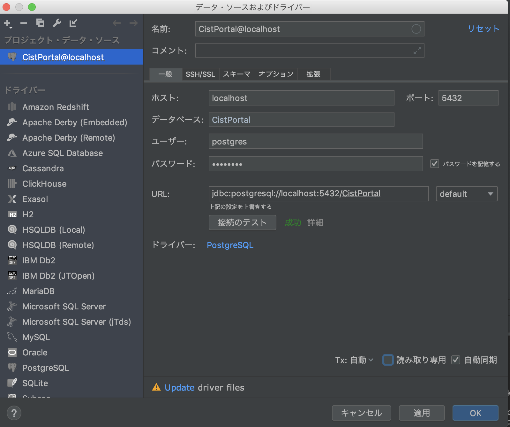

# データベース構築手順
　PostgreSQLのインストールが済んでいる前提です。
## データベースとRoleの作成
※ ***role_name***にはDB作成権限のあるroleの名前を入れてください。  
※  [ ] は必要ありませんので、実行時は外してください。
1. コマンドプロンプト or ターミナル を開く
1. ` createdb -U [role_name] CistPortal `  を実行  
1. ` psql -U [role_name]  CistPortal` を実行
1. ` create role postgres login password 'postgres'; ` を実行  
すでにpostgresというロールを作成済みの人は4.で失敗しますが気にしなくて良いです。
1. ` exit ` または ` \q ` でデータベースから抜ける

## intellijとDBをつなげる
1. CistPortalのプロジェクトを開いた状態で画面右側の` データベース(Database) `を押す
1. ` + `を押す
1. ` データ・ソース(Data Source) `から` PostgreSQL `を選択
1. 以下の画像の通りに入力し、接続が成功であれば`適用`を押し最後に `OK`を押して閉じる

## tableを作成する
1. データベースの `New console` を押してコンソールを開く
1. 開いたconsoleに `init.sql` の中身をコピペして実行
1. DBの中を探しpublicの中にコピペした内容のtableが作成されていれば完了

